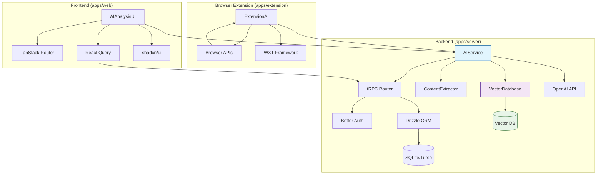

# 🏗️ Component Architecture

## New Components

### AIService
**Responsibility:** Handle AI content analysis, vector embedding generation, and semantic search
**Integration Points:** Integrated with existing server-side tRPC routes, providing AI services for web app and extension

**Key Interfaces:**
- `analyzeContent(url: string): Promise<AIAnalysisResult>` - Analyze web content
- `generateEmbedding(text: string): Promise<number[]>` - Generate vector embeddings
- `semanticSearch(query: string, userId: string): Promise<SearchResult[]>` - Semantic search
- `categorizeBookmark(content: string): Promise<Category>` - Intelligent categorization
- `extractTags(content: string): Promise<string[]>` - Tag extraction

**Dependencies:**
- **Existing Components:** tRPC router, Drizzle ORM, Better Auth
- **New Components:** VectorDatabase, OpenAI API, ContentExtractor
- **Technology Stack:** Hono + TypeScript, LangChain.js, OpenAI SDK

### VectorDatabase
**Responsibility:** Manage vector storage and similarity search
**Integration Points:** Provide vector storage and retrieval capabilities for AIService

**Key Interfaces:**
- `storeEmbedding(id: string, vector: number[], metadata: any): Promise<void>` - Store vectors
- `searchSimilar(vector: number[], limit: number): Promise<SimilarityResult[]>` - Similarity search
- `updateEmbedding(id: string, vector: number[]): Promise<void>` - Update vectors
- `deleteEmbedding(id: string): Promise<void>` - Delete vectors

**Dependencies:**
- **Existing Components:** Database connection
- **New Components:** AIService
- **Technology Stack:** Pinecone/Weaviate SDK, TypeScript

### ContentExtractor
**Responsibility:** Extract and clean content from web pages
**Integration Points:** Provide clean text content for AIService

**Key Interfaces:**
- `extractContent(url: string): Promise<ExtractedContent>` - Extract web content
- `cleanText(html: string): Promise<string>` - Clean HTML text
- `extractMetadata(html: string): Promise<Metadata>` - Extract metadata

**Dependencies:**
- **Existing Components:** HTTP client
- **New Components:** AIService
- **Technology Stack:** Cheerio, TypeScript, HTTP client

### AIAnalysisUI
**Responsibility:** Display AI analysis results and provide intelligent search interface
**Integration Points:** Extend existing React components, add AI functionality interfaces

**Key Interfaces:**
- `AnalysisResultCard(props: AnalysisResultProps)` - Analysis result card
- `SmartSearchBox(props: SearchBoxProps)` - Intelligent search box
- `AISettingsPanel(props: SettingsProps)` - AI settings panel
- `RecommendationList(props: RecommendationProps)` - Recommendation list

**Dependencies:**
- **Existing Components:** shadcn/ui components, TanStack Router
- **New Components:** AIService (via tRPC)
- **Technology Stack:** React 19, TypeScript, TailwindCSS

### ExtensionAI
**Responsibility:** AI functionality in browser extension
**Integration Points:** Work with web app and server

**Key Interfaces:**
- `analyzeCurrentPage(): Promise<AnalysisResult>` - Analyze current page
- `suggestTags(content: string): Promise<string[]>` - Tag suggestions
- `quickSaveWithAI(): Promise<Bookmark>` - AI-assisted quick save

**Dependencies:**
- **Existing Components:** WXT extension framework, browser APIs
- **New Components:** AIService (via API)
- **Technology Stack:** WXT, React, TypeScript

## Component Interaction Diagram

---
