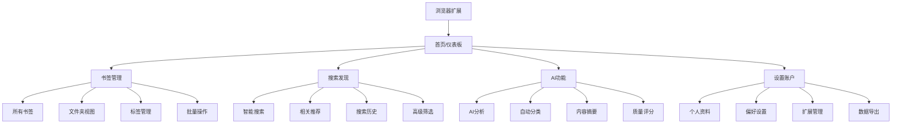
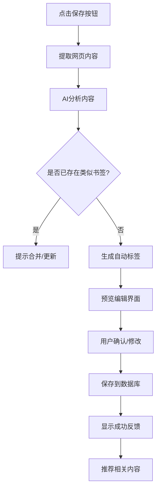
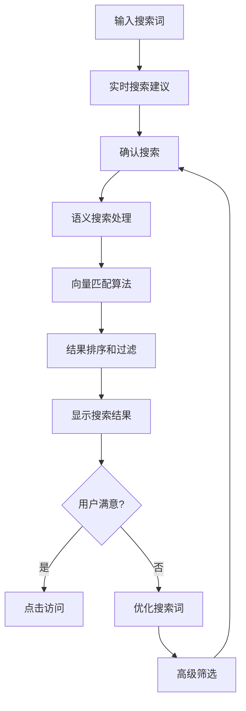
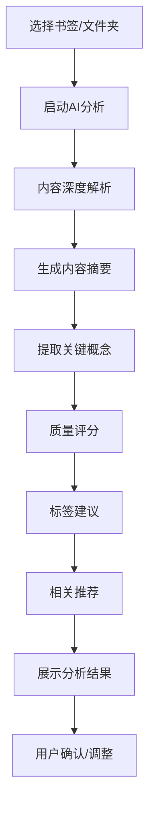

# LinkLink AI Bookmark Manager - UI/UX Specification

## 📋 文档概述

本文档定义了LinkLink AI书签管理器的用户体验目标、信息架构、用户流程和视觉设计规范，为视觉设计和前端开发提供基础，确保一致性和以用户为中心的体验。

## 🎯 整体UX目标与原则

### 目标用户画像

**主要用户群体：技术专业人士和知识工作者**

- **年龄：** 25-45岁
- **教育背景：** 学士学位或更高
- **职业：** 软件开发人员、数据科学家、产品经理、研究人员
- **技术熟练度：** 对技术和AI工具有很高的接受度

**当前行为：**
- 大量使用互联网进行研究和学习
- 目前使用浏览器书签或Pocket、Notion、Raindrop.io等工具
- 手动整理资源，使用文件夹和标签
- 通过电子邮件、Slack或其他消息平台共享资源

**核心需求：**
- 需要高效保存和组织技术资源的方法
- 希望发现其领域内新的高质量内容
- 寻求与团队成员有效分享知识的方式
- 希望AI协助减少手动整理负担

### 可用性目标

- **搜索效率：** 将保存书签的平均搜索时间减少70%
- **内容利用率：** 将书签回访率从22%提高到60%
- **AI准确性：** 实现85%的自动分类准确率
- **用户满意度：** 维持4.5/5以上的用户满意度评分
- **时间节省：** 减少90%的手动整理时间
- **学习曲线：** 新用户可以在5分钟内完成核心任务
- **操作效率：** 高级用户可以完成频繁任务时点击次数最少化

### 设计原则

1. **智能优先** - AI功能应该是核心体验，而不是附加功能
2. **简洁高效** - 减少手动操作，最大化自动化
3. **渐进式展示** - 根据用户需求显示相关信息
4. **即时反馈** - 每个操作都有清晰的响应
5. **无障碍设计** - 确保所有用户都能使用

### 变更日志

| 日期 | 版本 | 描述 | 作者 |
|------|------|------|------|
| 2025-09-09 | v1.0 | 初始UI/UX规范文档创建 | UX Expert |

## 🗺️ 信息架构 (IA)

### 站点地图 / 屏幕清单



### 导航结构

**主导航：**
- 仪表板（首页）
- 书签库
- 搜索发现
- AI助手
- 设置

**次要导航：**
- 面包屑导航
- 标签云
- 快速筛选器
- 最近访问

**导航策略：**
- 侧边栏主导航（桌面端）
- 底部导航栏（移动端）
- 上下文相关的快速操作

## 🔄 用户流程

### 保存新书签

**用户目标：** 快速保存网页并自动整理

**入口点：** 浏览器扩展按钮、网页右键菜单、手动添加URL

**成功标准：** 用户可以在3秒内完成保存，AI自动分类准确率>85%



**边缘情况与错误处理：**
- 网络连接失败时的离线保存机制
- 内容提取失败时的手动输入选项
- 重复书签的智能合并建议
- 大量书签的批量处理策略

**备注：** 流程设计重点在于速度和智能化，减少用户手动操作。

### 智能搜索

**用户目标：** 快速找到需要的书签内容

**入口点：** 主页搜索框、全局快捷键、书签页面搜索

**成功标准：** 搜索响应时间<1秒，相关结果准确率>90%



### AI内容分析

**用户目标：** 利用AI自动整理和发现内容价值

**入口点：** 书签详情页、批量操作菜单、定时任务

**成功标准：** 分析完成时间<5秒，用户采纳率>70%



## 🎨 线框图和模型

### 主要设计文件

**主要设计文件：** 待确认设计工具（建议Figma）

### 关键屏幕布局

#### 主仪表板

**目的：** 用户的第一印象，提供整体概览和快速操作

**关键元素：**
- 顶部搜索栏（全局搜索）
- 统计卡片（书签总数、新增数量、AI分析进度）
- 最近添加的书签网格
- AI推荐内容区域
- 快速操作按钮（添加书签、批量导入）

**交互说明：**
- 搜索栏支持实时搜索建议
- 统计卡片可点击查看详情
- 推荐内容基于用户行为算法

**设计文件参考：** 待创建

#### 书签管理界面

**目的：** 核心的书签组织和管理功能

**关键元素：**
- 侧边栏导航（文件夹、标签、筛选器）
- 主内容区域（书签列表/网格视图）
- 批量操作工具栏
- 排序和筛选选项
- AI分析状态指示器

**交互说明：**
- 支持拖拽整理
- 多选批量操作
- 实时AI分析进度显示

**设计文件参考：** 待创建

#### 搜索结果页面

**目的：** 高效的搜索体验和结果展示

**关键元素：**
- 搜索框和筛选器
- 搜索结果统计
- 相关标签建议
- 结果列表（标题、摘要、标签、相关性评分）
- 分页或无限滚动

**交互说明：**
- 搜索结果高亮显示
- 支持搜索词优化建议
- 相关内容推荐

**设计文件参考：** 待创建

#### 书签详情页

**目的：** 深度内容展示和AI分析结果

**关键元素：**
- 页面预览和基本信息
- AI生成的内容摘要
- 标签管理和建议
- 相关推荐
- 质量评分和分析报告

**交互说明：**
- 支持标签编辑和AI建议
- 可展开的详细分析
- 快速分享功能

**设计文件参考：** 待创建

## 🧩 组件库 / 设计系统

### 设计系统方法

**设计系统方法：** 基于shadcn/ui构建定制化设计系统

**理由：**
- shadcn/ui提供了现代、可访问的组件基础
- 支持完整的定制化
- 与TailwindCSS完美集成
- 活跃的社区支持
- 符合您的技术栈选择

### 核心组件

#### 搜索组件

**目的：** 全局搜索和智能搜索功能

**变体：**
- 紧凑搜索栏（导航栏中使用）
- 展开搜索框（主页和搜索页面）
- 实时搜索建议下拉框
- 高级搜索面板

**状态：**
- 默认状态
- 聚焦状态
- 搜索中状态
- 有结果状态
- 无结果状态

**使用指南：**
- 支持键盘快捷键激活
- 搜索历史记录
- 智能搜索建议

#### 书签卡片组件

**目的：** 书签内容的展示和操作

**变体：**
- 网格视图卡片
- 列表视图卡片
- 紧凑模式卡片
- 详细信息卡片

**状态：**
- 默认状态
- 选中状态
- AI分析中状态
- 已分析状态
- 悬停状态

**使用指南：**
- 支持批量选择
- 拖拽功能
- 快速操作菜单

#### AI分析组件

**目的：** 展示AI分析结果和进度

**变体：**
- 进度指示器
- 分析结果卡片
- 质量评分组件
- 标签建议组件

**状态：**
- 等待分析状态
- 分析中状态
- 完成状态
- 错误状态

**使用指南：**
- 支持中断和重试
- 分析结果可编辑
- 支持用户反馈

#### 标签管理组件

**目的：** 标签的创建、编辑和管理

**变体：**
- 标签输入框
- 标签云显示
- 标签筛选器
- 标签编辑器

**状态：**
- 编辑状态
- 只读状态
- 选择状态
- 建议状态

**使用指南：**
- 支持AI自动建议
- 支持颜色分类
- 支持层级结构

#### 数据展示组件

**目的：** 统计数据和分析结果的展示

**变体：**
- 统计卡片
- 图表组件
- 进度条
- 排行榜

**状态：**
- 加载状态
- 数据状态
- 空状态
- 错误状态

**使用指南：**
- 支持实时更新
- 支持交互式图表
- 支持数据导出

#### 表单组件

**目的：** 用户输入和数据收集

**变体：**
- 登录/注册表单
- 书签添加表单
- 设置表单
- 批量操作表单

**状态：**
- 默认状态
- 验证状态
- 提交状态
- 成功/错误状态

**使用指南：**
- 支持实时验证
- 支持自动保存
- 支持键盘导航

## 🎨 品牌与样式指南

### 视觉识别

**品牌指南：** 待确认

建议的品牌调性：
- 现代、智能、专业
- 可信赖、高效
- 技术驱动但用户友好
- 清晰简洁

### 色彩方案

| 色彩类型 | 十六进制代码 | 用途 |
|---------|------------|------|
| Primary | #3B82F6 | 主要按钮、链接、重点元素 |
| Secondary | #10B981 | 成功状态、积极反馈 |
| Accent | #F59E0B | 警告、重要提示 |
| Success | #22C55E | 成功操作、完成状态 |
| Warning | #EF4444 | 错误、危险操作 |
| Error | #DC2626 | 严重错误、删除操作 |
| Neutral | #6B7280 | 次要文本、边框 |
| Background | #F9FAFB | 页面背景 |
| Surface | #FFFFFF | 卡片、面板背景 |

**色彩使用逻辑：**
- 蓝色系体现技术和可信赖感
- 绿色系表示AI分析和成功状态
- 橙色系用于重要提示和警告
- 红色系用于错误和危险操作
- 灰色系用于次要信息和分隔

### 字体系统

#### 字体家族

- **Primary:** Inter (现代、清晰、技术感)
- **Secondary:** system-ui (后备字体)
- **Monospace:** JetBrains Mono (代码、技术内容)

#### 字体比例

| 元素 | 大小 | 字重 | 行高 |
|------|------|------|------|
| H1 | 36px | 700 | 1.2 |
| H2 | 28px | 600 | 1.3 |
| H3 | 22px | 600 | 1.4 |
| H4 | 18px | 600 | 1.5 |
| Body | 16px | 400 | 1.6 |
| Small | 14px | 400 | 1.5 |
| Caption | 12px | 500 | 1.4 |

### 图标系统

**图标库：** Lucide React

**使用指南：**
- 保持24px标准尺寸
- 使用一致的描边宽度
- 支持颜色主题适配
- 图标含义要直观明确

### 间距与布局

**网格系统：** 8px基础网格

**间距比例：**
- 4px, 8px, 12px, 16px, 24px, 32px, 48px, 64px

**布局原则：**
- 使用Flexbox和Grid布局
- 保持一致的内外边距
- 响应式断点适配
- 卡片式布局设计

## ♿ 无障碍要求

### 合规目标

**标准：** WCAG 2.1 AA级

**理由：**
- 法律合规要求
- 扩大用户群体
- 提升整体用户体验
- 体现社会责任

### 关键要求

#### 视觉要求：
- **色彩对比度：** 所有文本对比度至少4.5:1，大文本至少3:1
- **焦点指示器：** 清晰的键盘导航焦点样式，2px轮廓或对比度3:1
- **文本大小：** 支持浏览器缩放到200%不失真
- **动画减少：** 提供减少动画的选项

#### 交互要求：
- **键盘导航：** 所有功能都可通过键盘访问（Tab、Enter、Space）
- **屏幕阅读器支持：** 完整的ARIA标签和角色定义
- **触摸目标：** 移动端触摸目标至少44x44px
- **操作时间：** 用户可调整操作时间限制

#### 内容要求：
- **替代文本：** 所有图片都有描述性alt文本
- **标题结构：** 语义化的HTML标题层级（H1-H6）
- **表单标签：** 所有表单控件都有关联的label
- **链接文本：** 链接文本要描述清楚目的地

### 具体实现要求

#### 色彩无障碍

- 确保主要色彩方案符合对比度要求
- 提供高对比度主题选项
- 不单独依赖色彩传达信息
- 支持系统色彩主题

#### 键盘导航

- Tab顺序符合逻辑阅读顺序
- 支持Skip Links跳转导航
- 快捷键不冲突浏览器功能
- 提供快捷键帮助文档

#### 屏幕阅读器

- 使用语义化HTML5元素
- 提供ARIA landmarks导航
- 动态内容变化要有屏幕阅读器通知
- 表格要有适当的标题和描述

#### 表单无障碍

- 所有输入字段都有关联的label
- 提供实时验证反馈
- 错误信息要明确且可访问
- 支持自动完成功能

#### 媒体无障碍

- 视频内容提供字幕
- 音频内容提供文字记录
- 可控制的媒体播放器
- 避免自动播放媒体

### 测试策略

**自动化测试：**
- 使用axe-core进行自动化检查
- Lighthouse无障碍审计
- CI/CD集成无障碍测试

**手动测试：**
- 键盘导航测试
- 屏幕阅读器测试（NVDA、VoiceOver）
- 色彩对比度验证
- 真实用户测试

**测试工具：**
- axe DevTools
- WAVE Web Accessibility Evaluator
- Color Contrast Analyzer
- 屏幕阅读器软件

### 无障碍检查清单

- [x] 所有图片都有alt文本
- [x] 表单控件都有关联label
- [x] 链接文本描述清楚
- [x] 色彩对比度符合标准
- [x] 键盘导航完整可用
- [x] 焦点指示器清晰可见
- [x] 语义化HTML结构
- [x] ARIA标签正确使用
- [x] 响应式设计无障碍
- [x] 动画可控制或关闭

## 📱 响应式策略

### 断点

| 断点 | 最小宽度 | 最大宽度 | 目标设备 |
|------|----------|----------|----------|
| Mobile | 320px | 768px | 智能手机 |
| Tablet | 768px | 1024px | 平板设备 |
| Desktop | 1024px | 1440px | 笔记本电脑 |
| Wide | 1440px | - | 台式机、大屏幕 |

### 适配模式

**布局变化：**
- **移动端：** 单列布局，底部导航，垂直堆叠
- **平板端：** 2-3列网格，侧边栏可折叠，优化触摸
- **桌面端：** 多列布局，固定侧边栏，充分利用空间
- **宽屏端：** 最大宽度限制，内容居中，侧边栏可选

**导航变化：**
- **移动端：** 汉堡菜单 + 底部导航栏
- **平板端：** 水平标签导航 + 可折叠侧边栏
- **桌面端：** 完整侧边栏导航 + 面包屑
- **宽屏端：** 固定侧边栏 + 多级导航

**内容优先级：**
- **移动端：** 核心功能优先，简化信息展示
- **平板端：** 平衡功能和信息，适中复杂度
- **桌面端：** 完整功能展示，丰富信息层次
- **宽屏端：** 扩展功能，并行任务支持

**交互变化：**
- **移动端：** 触摸手势，滑动操作，大按钮
- **平板端：** 触摸+键盘，中等大小控件
- **桌面端：** 键盘+鼠标，精确交互，快捷键
- **宽屏端：** 高级交互，多窗口，拖拽功能

### 具体页面适配策略

#### 主仪表板

**移动端：**
- 简化统计卡片（只显示关键指标）
- 垂直堆叠的书签列表
- 底部固定导航栏
- 搜索框在顶部

**平板端：**
- 2列网格布局
- 可折叠的侧边栏
- 水平滚动标签
- 适中的卡片大小

**桌面端：**
- 多列灵活布局
- 固定侧边栏
- 丰富的统计信息
- 悬浮操作按钮

#### 书签管理

**移动端：**
- 列表视图为主
- 批量操作通过长按
- 筛选器在弹出层
- 简化的排序选项

**平板端：**
- 网格/列表切换
- 侧边栏筛选器
- 工具栏固定顶部
- 支持拖拽整理

**桌面端：**
- 多视图模式
- 丰富的筛选选项
- 右键菜单操作
- 高级排序功能

#### 搜索界面

**移动端：**
- 全屏搜索界面
- 简化的筛选器
- 垂直结果列表
- 键盘自动聚焦

**平板端：**
- 搜索框+结果并排
- 侧边栏高级筛选
- 分页或无限滚动
- 相关建议区域

**桌面端：**
- 固定搜索区域
- 复杂筛选器面板
- 多列结果展示
- 搜索历史侧边栏

### 技术实现策略

**CSS方法：**
- 使用Tailwind CSS的响应式工具类
- Mobile-first设计思路
- Flexbox和Grid布局
- CSS变量管理断点

**JavaScript策略：**
- 窗口大小监听
- 设备检测和特性检测
- 触摸事件处理
- 性能优化（防抖/节流）

**图片和媒体：**
- 响应式图片（srcset）
- 懒加载实现
- 适当的图片格式
- 视频适配处理

**测试策略：**
- 真实设备测试
- 浏览器开发者工具
- 响应式测试工具
- 性能监控

## ✨ 动画与微交互

### 动画原则

**核心原则：**
- **功能性优先** - 动画应该帮助用户理解界面变化
- **性能敏感** - 确保动画不会影响应用性能
- **可控制性** - 用户可以减少或关闭动画
- **一致性** - 整个应用使用统一的动画语言
- **无障碍** - 考虑前庭障碍用户的需求

### 关键动画

#### 页面过渡动画

- **页面切换：** 淡入淡出效果 (Duration: 200ms, Easing: ease-in-out)
- **模态框显示：** 缩放淡入效果 (Duration: 150ms, Easing: ease-out)

#### 交互反馈动画

- **按钮点击：** 轻微缩放效果 (Duration: 100ms, Easing: ease-in-out)
- **加载状态：** 旋转加载器或脉冲动画 (Duration: 1000ms, Easing: linear)
- **成功/错误提示：** 滑入动画 (Duration: 300ms, Easing: ease-out)

#### 内容动画

- **书签卡片：** 悬停提升效果 (Duration: 200ms, Easing: ease-in-out)
- **搜索建议：** 下拉展开动画 (Duration: 150ms, Easing: ease-out)
- **标签输入：** 标签添加动画 (Duration: 200ms, Easing: ease-out)

#### AI功能动画

- **AI分析进度：** 进度条动画 (Duration: 根据实际时间, Easing: ease-in-out)
- **内容生成：** 打字机效果 (Duration: 根据内容长度, Easing: linear)
- **推荐内容：** 卡片滑入动画 (Duration: 300ms, Easing: ease-out)

### 技术实现

**CSS动画：**
```css
/* 基础动画类 */
.fade-in {
  animation: fadeIn 0.2s ease-in-out;
}

@keyframes fadeIn {
  from { opacity: 0; }
  to { opacity: 1; }
}

/* 性能优化：使用transform */
.scale-up {
  transform: scale(0.95);
  transition: transform 0.15s ease-out;
}

.scale-up:hover {
  transform: scale(1);
}
```

**JavaScript动画：**
- 使用Framer Motion或React Spring
- 复杂动画使用Web Animations API
- 条件动画根据用户偏好

**性能优化：**
- 使用will-change属性
- 硬件加速（transform, opacity）
- 避免布局重绘
- 按需加载动画库

### 无障碍考虑

**减少动画：**
- 尊重用户prefers-reduced-motion设置
- 提供静态替代方案
- 确保核心功能不依赖动画

**焦点管理：**
- 动画过程中保持焦点可见
- 模态框动画完成后自动聚焦
- 键盘导航动画同步

**屏幕阅读器：**
- 动画状态变化要有ARIA通知
- 重要信息不只依赖动画传达
- 提供文本描述动画效果

## ⚡ 性能考虑

### 性能目标

- **页面加载时间：** <2秒（首屏内容）
- **交互响应时间：** <100ms（用户操作反馈）
- **搜索响应时间：** <1秒（包括AI处理）
- **动画帧率：** 60fps（流畅动画）
- **内存使用：** <100MB（典型使用场景）

### 设计策略

**资源优化：**
- 图片懒加载和响应式图片
- 组件代码分割和按需加载
- 字体加载优化（本地字体优先）
- 静态资源CDN加速

**渲染优化：**
- 虚拟滚动（大量书签列表）
- 避免不必要的重渲染
- 使用CSS transforms替代布局变化
- 合理使用will-change属性

**缓存策略：**
- 智能书签缓存
- API响应缓存
- 静态资源长期缓存
- 离线功能支持

**加载策略：**
- 渐进式加载（关键内容优先）
- 骨架屏提升感知性能
- 预加载重要资源
- 后台加载次要功能

### 具体性能优化点

#### 书签列表性能

**虚拟滚动：**
- 只渲染可视区域内的书签
- 动态计算项目高度
- 支持不同大小的书签卡片
- 平滑滚动体验

**数据分页：**
- 初始加载20-30个项目
- 滚动时动态加载更多
- 预加载下一页数据
- 缓存已加载数据

**搜索优化：**
- 防抖搜索输入（300ms延迟）
- 本地缓存搜索结果
- 智能搜索建议
- 取消重复请求

#### AI功能性能

**异步处理：**
- AI分析在后台进行
- 进度实时反馈
- 可中断和重试
- 批量处理优化

**结果缓存：**
- 缓存AI分析结果
- 智能缓存失效策略
- 本地存储支持
- 增量更新机制

#### 图片和媒体优化

**图片处理：**
- 自动生成缩略图
- WebP格式支持
- 懒加载实现
- 图片质量自适应

**媒体预览：**
- 延迟加载预览内容
- 智能预加载策略
- 预览质量平衡
- 用户控制选项

### 监控和测量

**性能指标：**
- LCP（最大内容绘制）
- FID（首次输入延迟）
- CLS（累积布局偏移）
- TTI（可交互时间）

**用户体验指标：**
- 搜索完成时间
- 书签保存时间
- AI分析响应时间
- 页面切换流畅度

**监控工具：**
- Web Vitals监控
- 性能APM集成
- 用户行为分析
- 错误监控

### 移动端性能

**特殊考虑：**
- 网络条件适配
- 电池使用优化
- 内存管理
- 触摸性能

**优化策略：**
- 简化移动端动画
- 减少网络请求
- 优化图片大小
- 离线功能支持

### 性能测试

**测试方法：**
- Lighthouse性能审计
- WebPageTest测试
- 真实设备测试
- 负载测试

**性能预算：**
- 页面总大小<1MB
- JavaScript包大小<300KB
- 图片总大小<500KB
- 请求次数<20

## 🎯 后续步骤

### 立即行动

1. **文档审查和确认**
   - 与团队分享文档内容
   - 收集反馈和修改建议
   - 确认所有设计决策

2. **设计工具设置**
   - 创建Figma设计文件
   - 建立设计系统基础
   - 制作关键界面原型

3. **技术准备**
   - 设置shadcn/ui组件库
   - 配置TailwindCSS主题
   - 建立组件开发环境

4. **开发对接**
   - 与前端开发团队对接
   - 制定组件开发优先级
   - 建立设计评审流程

### 设计交接检查清单

- [x] 所有用户流程已文档化
- [x] 组件清单完整
- [x] 无障碍要求已定义
- [x] 响应式策略清晰
- [x] 品牌指南已整合
- [x] 性能目标已建立

### 后续开发建议

**第一阶段：基础架构（2-3周）**
- 搭建React + shadcn/ui项目
- 实现基础组件库
- 建立设计令牌系统
- 配置响应式框架

**第二阶段：核心功能（3-4周）**
- 实现主仪表板
- 开发书签管理界面
- 集成搜索功能
- 实现浏览器扩展

**第三阶段：AI功能（2-3周）**
- 集成AI分析功能
- 实现智能推荐
- 优化用户体验
- 性能调优

**第四阶段：完善和测试（2-3周）**
- 完善所有功能
- 进行用户测试
- 修复问题
- 准备发布

### 风险和挑战

**技术风险：**
- AI集成复杂性
- 性能优化挑战
- 跨浏览器兼容性
- 移动端适配

**用户风险：**
- 用户接受度
- 学习曲线
- 功能期望管理
- 竞品对比

**缓解策略：**
- 早期用户测试
- 迭代开发方法
- 性能监控
- 用户反馈收集

### 成功指标

**设计成功指标：**
- 用户满意度 >4.5/5
- 任务完成率 >90%
- 学习时间 <5分钟
- 错误率 <5%

**业务成功指标：**
- 用户留存率 >40%
- 功能使用率 >80%
- 推荐转化率 >15%
- 支持请求减少 >30%

### 检查清单结果

*UI/UX Checklist 将在后续运行并报告结果*

---

**文档版本：** v1.0  
**创建日期：** 2025-09-09  
**最后更新：** 2025-09-09  
**状态：** 初稿完成，待团队审核

*本文档由UX Expert代理创建，基于BMAD™ Core框架*