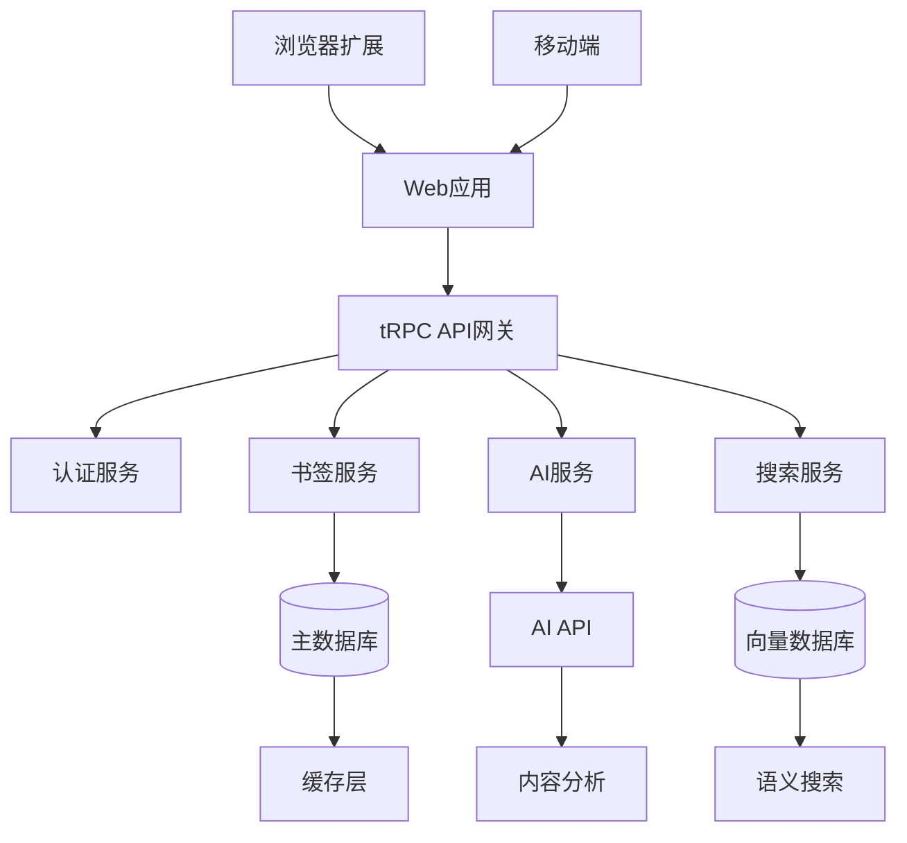

# LinkLink AI Bookmark Manager - Product Requirements Document

## 📋 项目概述

### 产品愿景

LinkLink是一个AI驱动的书签管理系统，将传统的书签存储转变为智能知识发现和创建平台。

### 产品定位

- **目标市场**：寻求高效知识管理的个人专业人士和团队，初期专注于技术人员和知识工作者
- **核心价值**：AI驱动的自动分类、智能内容发现和协作知识共享
- **差异化优势**：将被动的书签存储转变为主动的知识创建

## 🎯 项目目标

### 业务目标

- **用户增长**：6个月内达到10,000活跃用户
- **收入目标**：12个月内达到50,000美元月经常性收入
- **用户留存**：维持40%以上的月度用户留存率
- **转化率**：实现15%的免费到付费计划转化率
- **企业客户**：18个月内获得50个企业客户

### 用户成功指标

- **搜索效率**：将保存书签的平均搜索时间减少70%
- **内容利用率**：将书签回访率从22%提高到60%
- **AI准确性**：实现85%的自动分类准确率
- **用户满意度**：维持4.5/5以上的用户满意度评分
- **时间节省**：减少90%的手动整理时间

## 👥 目标用户

### 主要用户群体：技术专业人士和知识工作者

**用户画像**

- **年龄**：25-45岁
- **教育背景**：学士学位或更高
- **职业**：软件开发人员、数据科学家、产品经理、研究人员
- **技术熟练度**：对技术和AI工具有很高的接受度

**当前行为**

- 大量使用互联网进行研究和学习
- 目前使用浏览器书签或Pocket、Notion、Raindrop.io等工具
- 手动整理资源，使用文件夹和标签
- 通过电子邮件、Slack或其他消息平台共享资源

**核心需求**

- 需要高效保存和组织技术资源的方法
- 希望发现其领域内新的高质量内容
- 寻求与团队成员有效分享知识的方式
- 希望AI协助减少手动整理负担

### 次要用户群体：团队和组织

**组织特征**

- **公司规模**：10-500名员工
- **行业**：技术、咨询、研究、教育
- **部门**：工程、产品、研究、市场营销

**组织需求**

- 需要集中的知识库
- 希望避免重复的研究工作
- 需要共享资源的质量控制
- 需要知识使用和价值的分析

## 🚀 MVP功能范围

### 核心功能（必须具备）

#### 1. AI驱动的书签收集

- **浏览器扩展**：一键保存功能
- **自动内容分析**：内容理解和分类
- **基本质量评估**：质量评分和排名
- **向量搜索**：语义匹配搜索

#### 2. 智能整理

- **自动标签和分类**：基于内容的智能分类
- **智能文件夹创建**：基于内容主题自动创建文件夹
- **重复检测和合并**：识别和合并重复书签
- **内容摘要**：关键点提取和总结

#### 3. 搜索和发现

- **语义搜索**：自然语言查询搜索
- **基于内容的相似推荐**：相关内容推荐
- **基本过滤和排序**：灵活的筛选选项
- **搜索历史**：频繁访问跟踪

#### 4. 用户界面

- **简洁直观的Web应用**：现代化用户界面
- **响应式设计**：移动设备适配
- **基本书签管理操作**：CRUD操作
- **用户仪表板**：分析数据展示

### MVP范围之外的功能

- **高级团队协作功能**
- **企业级管理控制**
- **高级社交分享功能**
- **移动应用程序（MVP仅限Web）**
- **超出基本API的第三方集成**
- **高级分析和报告**
- **自定义AI模型训练**
- **高级内容生成功能**

## 🏗️ 技术架构

### 技术栈选择

#### 前端技术栈

- **框架**：React 19
- **路由**：TanStack Router
- **UI组件库**：shadcn/ui
- **样式**：TailwindCSS
- **状态管理**：React Query + Zustand
- **API通信**：tRPC
- **认证**：Better Auth

#### 后端技术栈

- **框架**：Hono + tRPC
- **数据库**：Drizzle ORM + SQLite/Turso
- **认证**：Better Auth
- **AI服务**：OpenAI GPT API
- **向量数据库**：Pinecone/Weaviate
- **缓存**：Redis

#### 浏览器扩展

- **框架**：WXT + React
- **目标平台**：Chrome、Firefox、Safari

### 系统架构

### 数据库设计

#### 核心数据模型

- **用户表**：用户信息和偏好设置
- **书签表**：书签内容和元数据
- **标签表**：标签和分类信息
- **文件夹表**：组织结构
- **向量嵌入表**：AI分析结果

#### 关键考虑因素

- 支持大量用户书签（每用户10万+）
- 快速搜索响应（亚秒级）
- 数据安全和隐私保护
- GDPR合规性

## 📅 开发计划

### 第一阶段：MVP开发（4-6周）

#### 第1-2周：核心架构搭建

- [ ] 设置开发环境和CI/CD
- [ ] 实现用户认证系统
- [ ] 搭建数据库架构
- [ ] 建立API基础结构

#### 第3-4周：基础功能实现

- [ ] 实现书签CRUD操作
- [ ] 开发浏览器扩展
- [ ] 集成AI内容分析
- [ ] 实现基本搜索功能

#### 第5-6周：完善和测试

- [ ] 实现用户界面
- [ ] 完善搜索和推荐
- [ ] 进行用户测试
- [ ] 性能优化和部署

### 第二阶段：增强功能（6-8周）

#### 第7-8周：高级AI功能

- [ ] 个性化推荐系统
- [ ] 智能内容分类
- [ ] 自动标签生成
- [ ] 内容质量评估

#### 第9-10周：协作功能

- [ ] 基本团队功能
- [ ] 共享书签集合
- [ ] 权限管理
- [ ] 活动通知

#### 第11-12周：分析和优化

- [ ] 用户分析仪表板
- [ ] 使用统计和报告
- [ ] 性能监控
- [ ] A/B测试框架

### 第三阶段：企业功能（4-6周）

#### 第13-14周：企业级功能

- [ ] 高级管理控制
- [ ] SSO集成
- [ ] 安全和合规
- [ ] API访问

#### 第15-16周：市场推广

- [ ] 产品发布准备
- [ ] 营销材料制作
- [ ] 用户获取策略
- [ ] 客户支持体系

#### 第17-18周：迭代优化

- [ ] 用户反馈收集
- [ ] 功能迭代优化
- [ ] 性能调优
- [ ] 扩展性改进

## 🎨 用户界面设计

### 设计原则

- **简洁直观**：降低学习成本
- **响应式设计**：适配多种设备
- **现代化UI**：使用shadcn/ui组件库
- **一致性**：保持设计语言统一
- **可访问性**：符合WCAG标准

### 主要界面

#### 1. 主仪表板

- 书签统计概览
- 最近添加的书签
- 推荐内容
- 快速搜索

#### 2. 书签管理界面

- 书签列表视图
- 网格视图选项
- 批量操作功能
- 高级筛选器

#### 3. 搜索界面

- 智能搜索框
- 搜索结果高亮
- 相关推荐
- 搜索历史

#### 4. 浏览器扩展

- 一键保存按钮
- 快速标签编辑
- 即时预览
- 同步状态显示

## 🔧 功能需求

### 功能性需求

#### 用户管理

- **FR1**: 用户注册和登录功能
- **FR2**: 个人资料管理
- **FR3**: 偏好设置配置
- **FR4**: 密码重置和安全设置

#### 书签管理

- **FR5**: 通过URL添加书签
- **FR6**: 编辑和删除书签
- **FR7**: 手动添加标签和文件夹
- **FR8**: 批量操作功能

#### AI功能

- **FR9**: 自动内容分析和分类
- **FR10**: 智能标签建议
- **FR11**: 内容质量评分
- **FR12**: 相关内容推荐

#### 搜索功能

- **FR13**: 全文搜索功能
- **FR14**: 语义搜索支持
- **FR15**: 高级过滤和排序
- **FR16**: 搜索历史记录

### 非功能性需求

#### 性能需求

- **NFR1**: 搜索响应时间<1秒
- **NFR2**: 支持每用户10万+书签
- **NFR3**: 系统可用性99.9%
- **NFR4**: 页面加载时间<2秒

#### 安全需求

- **NFR5**: 端到端加密
- **NFR6**: GDPR合规
- **NFR7**: 安全的API密钥管理
- **NFR8**: 用户数据保护

#### 可扩展性需求

- **NFR9**: 支持100万+用户
- **NFR10**: 水平扩展架构
- **NFR11**: 负载均衡支持
- **NFR12**: 数据库分片能力

## 📊 质量保证

### 测试策略

- **单元测试**：核心业务逻辑测试
- **集成测试**：API和数据库交互测试
- **端到端测试**：用户流程完整测试
- **性能测试**：负载和压力测试
- **安全测试**：漏洞和渗透测试

### 测试覆盖率

- **单元测试覆盖率**：>80%
- **集成测试覆盖率**：>70%
- **端到端测试**：关键用户流程100%
- **性能测试**：峰值负载测试

## 🚀 部署策略

### 环境设置

- **开发环境**：本地开发配置
- **测试环境**：自动化测试环境
- **预生产环境**：用户验收测试
- **生产环境**：最终部署环境

### 部署流程

- **CI/CD管道**：自动化构建和部署
- **蓝绿部署**：零停机部署策略
- **回滚机制**：快速回滚能力
- **监控告警**：实时监控和告警

## 📈 监控和分析

### 关键指标

- **用户指标**：DAU、MAU、留存率
- **性能指标**：响应时间、错误率、可用性
- **业务指标**：转化率、收入、客户获取成本
- **技术指标**：系统负载、数据库性能

### 监控工具

- **应用性能监控**：APM工具集成
- **日志管理**：集中化日志系统
- **错误跟踪**：错误收集和分析
- **用户行为分析**：用户行为追踪

## 💰 商业模式

### 定价策略

- **免费版**：基础功能，个人使用
- **专业版**：$9.99/月，高级AI功能
- **团队版**：$29.99/月，协作功能
- **企业版**：定制价格，企业功能

### 收入来源

- **订阅收入**：主要收入来源
- **企业服务**：定制开发和支持
- **API服务**：第三方集成
- **高级功能**：增值服务

## 🎯 成功标准

### 技术成功标准

- **系统稳定性**：99.9%可用性
- **搜索性能**：亚秒级响应
- **AI准确性**：95%分类准确率
- **用户规模**：支持100万+用户

### 用户成功标准

- **用户满意度**：>4.5/5评分
- **功能采用率**：>80%用户使用AI功能
- **时间节省**：减少70%搜索时间
- **内容利用率**：60%书签回访率

### 商业成功标准

- **用户增长**：6个月10,000用户
- **收入目标**：12个月50K MRR
- **转化率**：15%免费到付费
- **企业客户**：18个月50个客户

## 📝 附录

### 竞品分析

- **Pocket**：内容保存，缺乏AI功能
- **Notion**：知识管理，手动整理
- **Raindrop.io**：书签管理，基础AI
- **Instapaper**：阅读列表，功能有限

### 风险评估

- **技术风险**：AI模型准确性
- **市场风险**：用户接受度
- **竞争风险**：大公司进入市场
- **隐私风险**：用户数据安全

### 法律合规

- **GDPR**：用户数据保护
- **CCPA**：加州隐私权
- **数据安全**：加密和安全存储
- **API合规**：第三方服务条款

---

_文档版本：v1.0_  
_创建日期：2025-09-09_  
_最后更新：2025-09-09_  
_状态：初稿完成，待审核_
