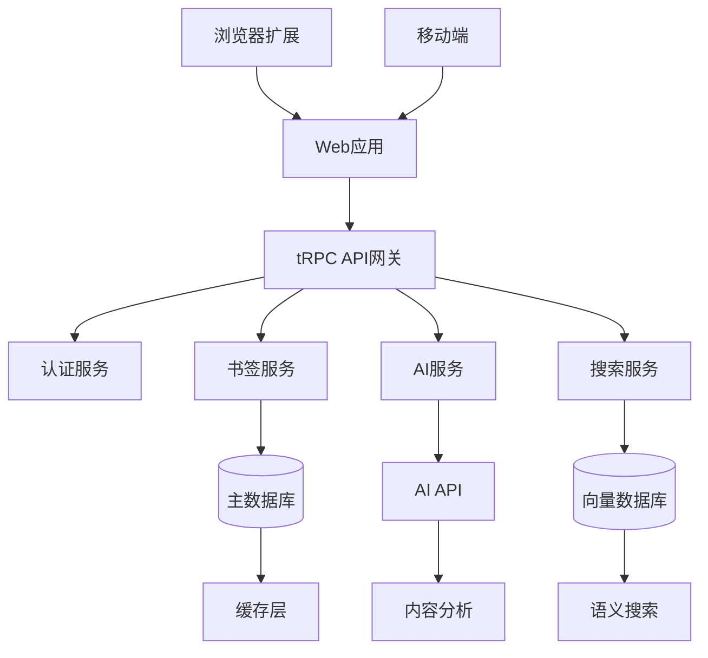

# 🏗️ 技术架构

## 技术栈选择

### 前端技术栈

- **框架**：React 19
- **路由**：TanStack Router
- **UI组件库**：shadcn/ui
- **样式**：TailwindCSS
- **状态管理**：React Query + Zustand
- **API通信**：tRPC
- **认证**：Better Auth

### 后端技术栈

- **框架**：Hono + tRPC
- **数据库**：Drizzle ORM + SQLite/Turso
- **认证**：Better Auth
- **AI服务**：OpenAI GPT API
- **向量数据库**：Pinecone/Weaviate
- **缓存**：Redis

### 浏览器扩展

- **框架**：WXT + React
- **目标平台**：Chrome、Firefox、Safari

## 系统架构

## 数据库设计

### 核心数据模型

- **用户表**：用户信息和偏好设置
- **书签表**：书签内容和元数据
- **标签表**：标签和分类信息
- **文件夹表**：组织结构
- **向量嵌入表**：AI分析结果

### 关键考虑因素

- 支持大量用户书签（每用户10万+）
- 快速搜索响应（亚秒级）
- 数据安全和隐私保护
- GDPR合规性
